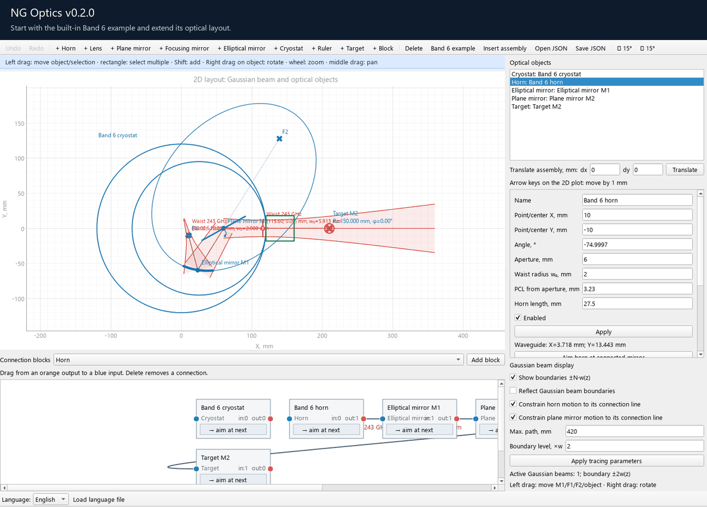

# NG Optics v0.2.0

**NG Optics** stands for **New Generation optics**. It is a lightweight desktop application for rapid prototyping of
sub-terahertz optical systems. Build a two-dimensional optical layout, move
components interactively, and inspect Gaussian beam propagation at multiple
frequencies in one workspace.

The application runs locally and works offline. It is intended for early-stage
layout design and paraxial optical modeling.



The demo starts with the built-in Band 6 example open. It shows adding a
horn to the existing layout, dragging it to a new position, adding a second
frequency channel, setting 230 GHz and 280 GHz, and adding another horn.

## Features

- Interactive 2D layout with drag-and-drop positioning, rotation, zoom and pan.
- Horn sources with multiple independently enabled frequency channels.
- Gaussian beam propagation, beam boundaries and waist position markers.
- Thin lenses, plane mirrors, focusing mirrors and elliptical mirrors.
- Independently editable elliptical mirror points and foci, with calculated
  ellipse geometry shown in the properties panel.
- A block diagram for connecting optical components and aiming supported
  objects at the next component.
- Group selection, assembly insertion and precise coordinate-based movement.
- Cryostats with up to four windows, rulers, targets and waveguide blocks.
- Undo and redo with a history of ten steps.
- JSON project files, including compatibility with the previous version.
- English and Russian interfaces, plus custom translation files.

## Windows application

The portable Windows x64 build is named **NG Optics v0.2.0.exe**. Run the EXE
directly; no Python installation is required. English is selected at startup.
The executable includes the built-in translations.

When building from this repository, the EXE is written to
`dist/NG Optics v0.2.0.exe`.

## Run from source

Requires Python 3.10 or later. The Windows release is built with Python 3.12.

```powershell
python -m venv .venv
.\.venv\Scripts\Activate.ps1
python -m pip install -r requirements.txt
python main.py
```

With the dependencies installed, Windows users can also run
`run_optics2d.bat`.

## Quick start

1. Start with the included Band 6 example, or select and delete components
   to create your own layout.
2. Click **+ Horn** in the top toolbar to add a source.
3. Left-drag the horn on the plot to move it. Right-drag to rotate it, or edit
   its coordinates and angle in the properties panel and click **Apply**.
4. Scroll down in the horn properties to **Frequency channels**. Click
   **+ Frequency**, double-click a frequency value, and enter a value in GHz.
   Use the checkboxes to enable or disable individual channels, then click
   **Apply** to update the traces.
5. Add mirrors or lenses. In the block diagram, drag from an orange output
   to a blue input to connect components. Use **aim at next** where available.
6. Save the layout with **Save JSON**, and reopen it with **Open JSON**.

Each horn has its own frequency list. The **Gaussian beam display** controls
set the visible beam boundaries, reflection behavior, maximum path length
and boundary scale.

## Controls

| Action | Control |
| --- | --- |
| Move an object or selected group | Left-drag |
| Rotate an object or selected group | Right-drag on the object |
| Select several objects | Drag a selection rectangle |
| Add to the selection | Shift-click |
| Move the selection by 1 mm | Arrow keys while the plot has focus |
| Translate an assembly precisely | Enter dx and dy, then click Translate |
| Zoom | Mouse wheel |
| Pan | Middle-button drag |
| Delete selected objects | Delete or Backspace while the plot has focus |
| Delete a connection | Select the connection, then press Delete |
| Undo | Ctrl+Z |
| Redo | Ctrl+Y or Ctrl+Shift+Z |

## Modeling scope

NG Optics models geometric optics and fundamental Gaussian beams in a single
2D plane using paraxial approximations. It is a prototyping tool, not a
full-wave electromagnetic solver. Coordinates and dimensions are in
millimeters; frequencies are in gigahertz.

## Project layout

```text
optics2d/           Interface, model, physics and localization loader
locales/            English and Russian translation files
save/               Example optical systems
tests/              Automated tests
tools/              Repeatable UI demo recorder
docs/media/         README animation and screenshot
main.py             Application entry point
```

## License

NG Optics is open-source software released under the
[GNU General Public License v3.0](LICENSE) (GPL-3.0-only).
This license covers the project source code, documentation, examples and demo
media in this repository. Third-party dependencies retain their respective
licenses.

## Development

ChatGPT was used during the development of NG Optics, including assistance
with implementation, debugging and documentation.
